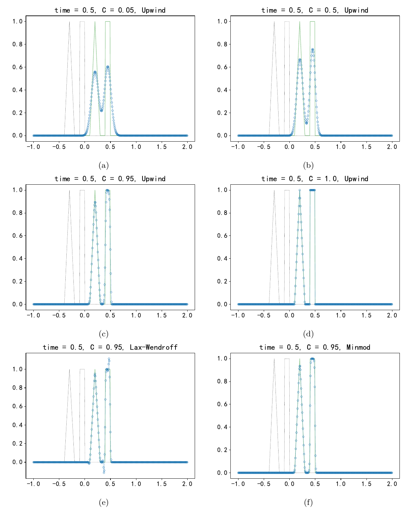
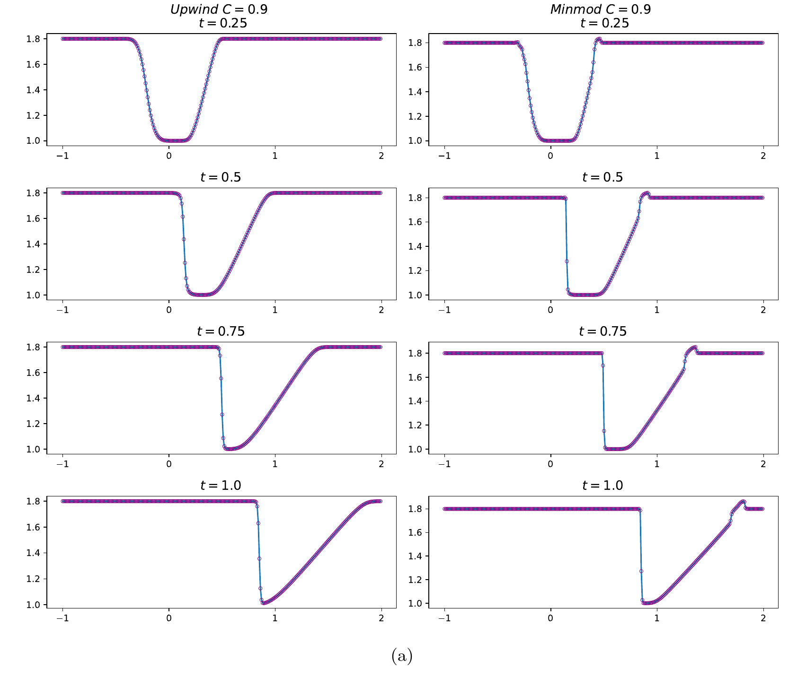

- `my_jacobian4enzyme.jl`: compute jacobian using Enzyme.autodiff (both forward and reverse mode AD) to handle mutating operations
- `Introduction_to_DG_methods.jl`: compute the Jacobian of the right-hand side evaluation Trixi.rhs! on a 1D mesh for the advection equation using DG schemes via ForwardDiff.jl.
- `my_advection_equation_1D.jl`: examples of numerical solutions of one-dimensional single-variable hyperbolic equations, including the advection equation and the Burgers equation

